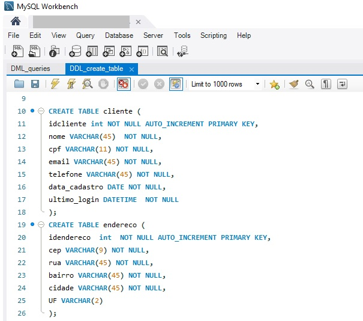

<h3>Desafio de projeto IV- E-commerce</h3>

<h4>Modelo lógico e Queries</h4>

Profª: Juliana Mascarenhas

Disciplina: SQL Fundamentos de Banco de dados

**Objetivo geral:**

Desenvolver um banco de dados para um <i>e-commerce</i>.

**Objetivos específicos:**

Explorar modelagem de dados e queries em SQL.

**Desenvolvimento:**

Para a Loja Virtual de vestuário feminino, **BellaBoutique**, foram feitas a pesquisa exploratória , Requisitos do usuário, Requisitos do sistema e mapeamento das Regras de negócio, como parte do **Modelo Conceitual**. Em momento posterior, realizamos a feitura do **Modelo Lógico**, definindo entidades, atributos e relacionamentos. Exploramos as **consultas básicas em SQL**.Para realização desse projeto criamos um cronograma de projetos, com as etapas e tempo para realização de cada tarefa.

Diretório **docs:**
Toda a documentação do projeto.
Diretório **Jupyter**: 
Notebook com scripts de criação dos DF a serem inseridos no Banco de dados.
Diretório **pandas:**
Contem os DF prontos para inserir no DB.
**Ferramentas:**

[Miro_app](https://miro.com/app/dashboard/): Para Use case

[MySQL_workbench](https://www.mysql.com/products/workbench/): para MER

[MySQL _server](https://dev.mysql.com/downloads/mysql/): SGDB

